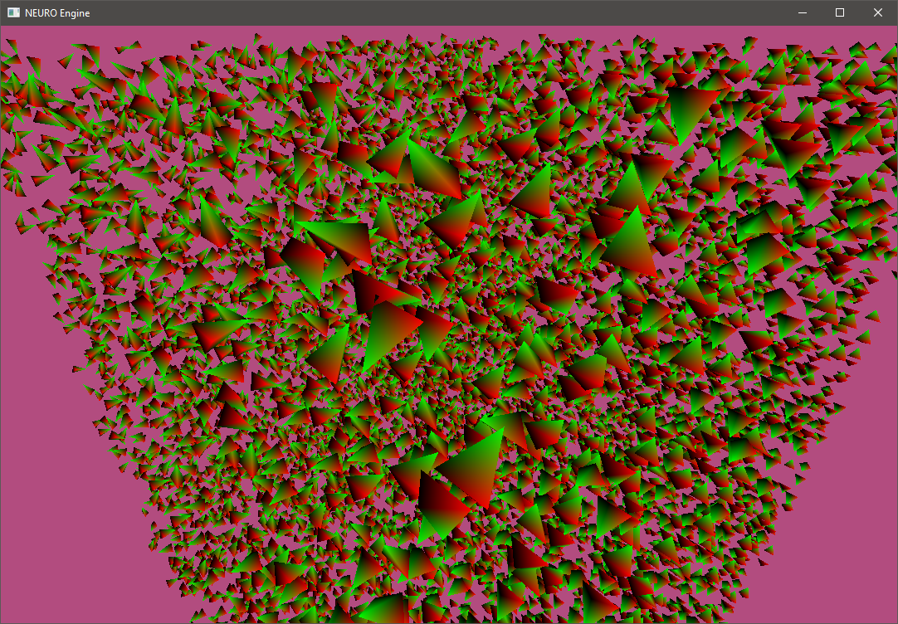

:milky_way: This is my game framework that I have been working on. I am using it as a way to learn graphics programming, C++17 and some C++20 programming, software engineering, and actual game programming! :milky_way:

Here is a demonstration of my implementation of Phong Lighting which includes (Ambient, Diffuse, and Specular Lighting)

